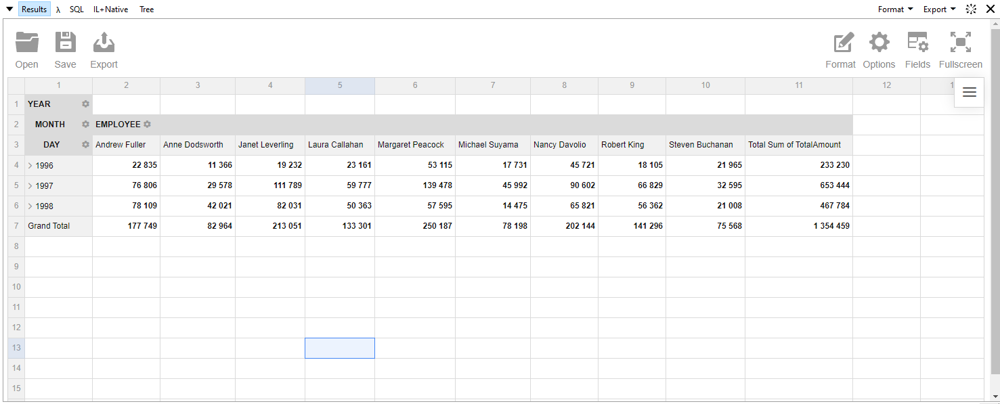

# PivotPad

Pivot extension for LINQPad.

## Usage

Add the `PivotPad` nuget package to your LINQPad query.

Example:

    var data = db.Orders.Pivot(e => 
        e
            .Column(f => f.Employee)
            .DateRow(f => f.OrderDate, PivotDatePart.Year|PivotDatePart.Month|PivotDatePart.Day)
            .Measure(f => f.TotalAmount, PivotAggregation.Sum)
	);

Uses https://www.webdatarocks.com/ for the pivot table. 
